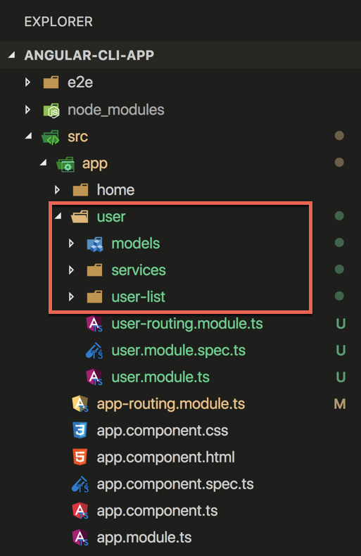

# 1c -  Brief Introduction To Angular

## 1. Refactor to use lazy loaded User module {#11-extra-add-extra-project-to-cli-app}

```text
ng g module user --routing
```

## 2.  Move all User related folders into the user module folder



## 3.  Remove all references to Users in App module



```typescript
import { BrowserModule } from '@angular/platform-browser';
import { NgModule } from '@angular/core';

import { AppRoutingModule } from './app-routing.module';
import { AppComponent } from './app.component';
import { HomeComponent } from './home/home.component';
import { HttpClientModule } from '@angular/common/http';

@NgModule({
  declarations: [
    AppComponent,
    HomeComponent
  ],
  imports: [
    BrowserModule,
    AppRoutingModule,
    HttpClientModule
  ],
  providers: [],
  bootstrap: [AppComponent]
})
export class AppModule { }

```



## 4. Change routes to lazy loaded routes



```typescript
import { NgModule } from '@angular/core';
import { Routes, RouterModule } from '@angular/router';
import { HomeComponent } from './home/home.component';

const routes: Routes = [
  { path: '', component: HomeComponent },
  { path: 'users', loadChildren: 'src/app/user/user.module#UserModule' },   ///changed
];

@NgModule({
  imports: [RouterModule.forRoot(routes)],
  exports: [RouterModule]
})
export class AppRoutingModule { }

```



## 5. Add UserList component as feature module route



```typescript
import { NgModule } from '@angular/core';
import { Routes, RouterModule } from '@angular/router';
import { UserListComponent } from './user-list/user-list.component'; // changed

const routes: Routes = [
  { path: '', component: UserListComponent },    //changed
];

@NgModule({
  imports: [RouterModule.forChild(routes)],
  exports: [RouterModule]
})
export class UserRoutingModule { }

```



## 6. Declare UserList component in new User module



```typescript
import { NgModule } from '@angular/core';
import { CommonModule } from '@angular/common';
import { UserListComponent } from './user-list/user-list.component';   //added
import { UserRoutingModule } from './user-routing.module';

@NgModule({
  imports: [
    CommonModule,
    UserRoutingModule
  ],
  declarations: [
    UserListComponent            //added
  ]
})
export class UserModule { }

```



## 7. Add button on App component to navigate to UserList or Home component



```markup
<h1>The App</h1>
​
<div>
  <button [routerLink]="['/']" routerLinkActive="router-link-active" >home</button>
  <button [routerLink]="['/users']" routerLinkActive="router-link-active" >users</button>
</div>

<!-- <app-home></app-home> -->
<router-outlet></router-outlet>

```



## 8. Run the application and inspect the lazy loaded JavaScript


## Extras

### 1. Add extra project to CLI App

As of Angular CLI version 6+ you can now have multiple projects in an Angular app. It is early days and no support for sharing modules between apps and best practices or schematics made. That is what Nx can help with. You can read more on the Angular CLI limited docs ​[https://github.com/angular/angular-cli/wiki/stories-multiple-projects](https://github.com/angular/angular-cli/wiki/stories-multiple-projects)

In the terminal run

```text
ng generate application my-other-app
```


### 2. Add npm package library to your app

  
Angular CLI v6 comes with library support via [ng-packagr](https://github.com/dherges/ng-packagr) plugged into the build system we use in Angular CLI, together with schematics for generating a library.

[https://github.com/angular/angular-cli/wiki/stories-create-library](https://github.com/angular/angular-cli/wiki/stories-create-library)

In the terminal run

```text
ng generate library my-lib
```


